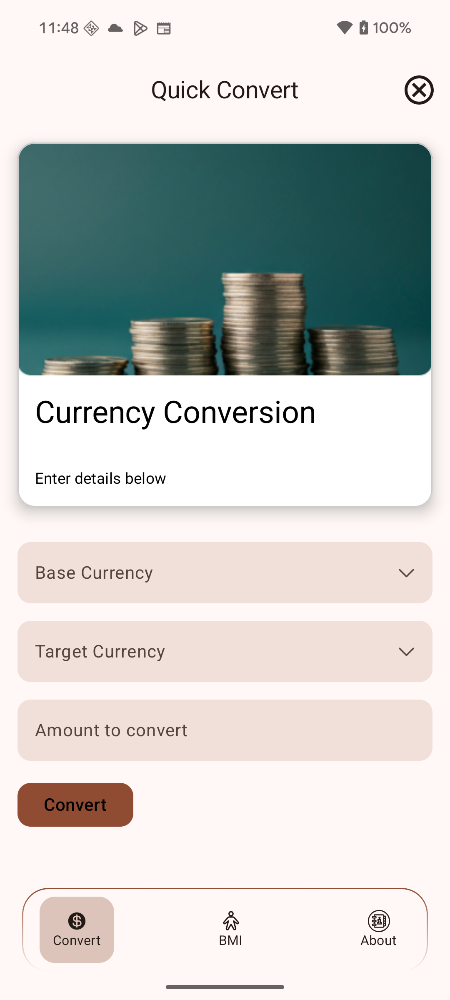
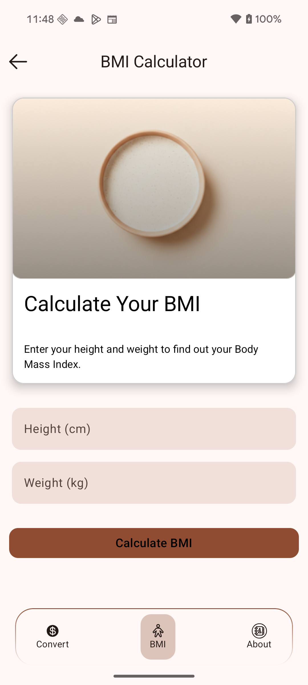
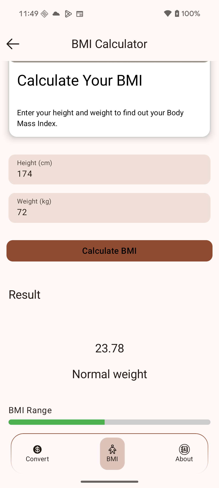

# Quick Convert 🚀

**Quick Convert** is a fast, lightweight, and intuitive mobile app designed to handle all your quick conversion needs — from currency conversions to essential utilities like **BMI calculation**. Whether you're traveling, shopping internationally, or tracking your health, Quick Convert is your all-in-one solution.

## 🌟 Features

- 🔁 **Currency Converter**  
  Convert between major world currencies with up-to-date exchange rates.

- ❤️ **BMI Calculator**  
  Easily calculate your Body Mass Index using metric or imperial units.

- 🌐 **Multi-Language Support**  
  Use the app in your preferred language.  
  **Currently supported languages:** English, हिंदी (Hindi), ಕನ್ನಡ (Kannada)

- 🎯 **Clean and Modern UI**  
  Designed with user experience in mind — intuitive layout and fast interactions.

## 📱 Screenshots

| Light                               | Dark                      |
|-------------------------------------|---------------------------|
|              |    |
|    |    |
|       |    |
|   |    |
|   |    |


## 📦 Tech Stack

- **Kotlin**
- **Jetpack Compose**
- **MVVM Architecture**
- **Coroutines & Flow**
- **Ktor (for API calls)**

## 🛠 Setup Instructions

1. Clone this repository:
   ```bash
   git clone https://github.com/3Tech-X/QuickConvert
